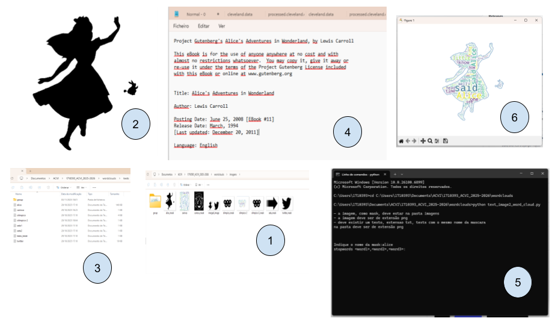

# 1710393_Acvi_2025

Course of Analisys, Communication and Visualization of Information.

## Basic Scripts
Same basic scripts in python

## WordClounds
Scripts to work with wordclounds

### text2frequency.py

### text2word_cloud.py

### text2word_cloud_frequency.py

### text_image2_word_cloud.py

Choose an image as mask, `<image>`_mask.png, and take a text for that image, `<image>`.text, the script allows you to adjust the text to the image

